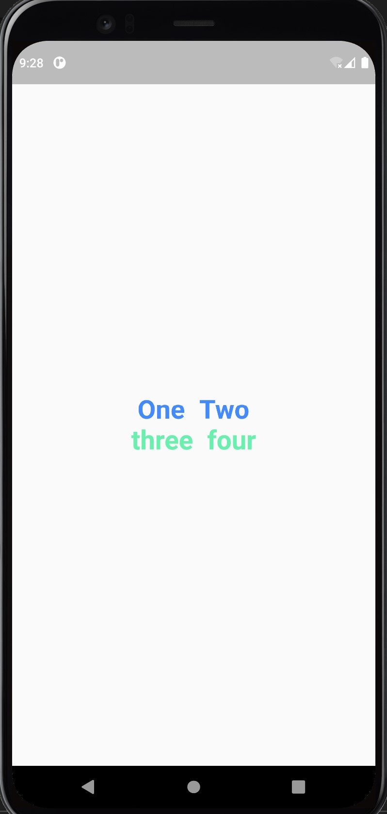

# UC-Flutter-cw-4

## تمرين 1
المطلوب صنع صفحة فيها كائنات Column & Row و اضافة التعديلات و التنسيقات لكي تعطينا النتيجة كما هو موضح بالصور :
1. قم بعمل fork للـ repository
2. افتح الـ repository باستخدام github desktop
3. ادخل على برنامج VS code   وانشاء ملف تمرين داخل مجلد cw-1 في ال repository
4. قم بإنشاء برنامج Flutter جديد و احفظه داخل الملف
5. أضف MatiralApp  و Scofield للبرنامج
6. اضف Column Widget  وبداخلها Row widget 2
7. في كل Row widget يتم اضافة Text widget

__________________________________________________________________________________________________

## تمرين 2
المطلوب صنع صفحة فيها صورة حيوانك المفضل و تحت الصورة نضيف بعض التفاصيل منها اسم الحيوان و العمر و الخ .. , مثال على التمرين :
1. ادخل على برنامج VS code   وانشاء ملف تمرين داخل مجلد cw-2 في ال repository
2. قم بإنشاء برنامج Flutter جديد و احفظه داخل الملف
3. أضف MatiralApp  و Scofield للبرنامج
4. اضف Column Widget  وبداخلها 2 container widget
5. يتم اضافة image widget داخل أول container widget
6. يتم اضافة text widget داخل أول container widget

