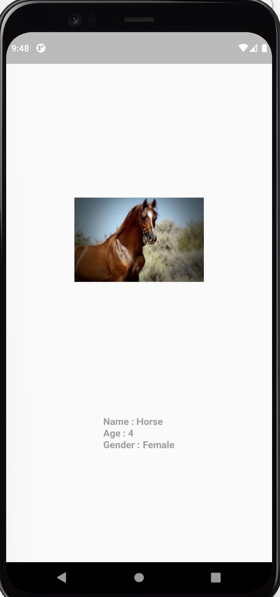

# UC-Flutter-cw-4

---

## تمرين 1

المطلوب صنع صفحة فيها صورة حيوانك المفضل و تحت الصورة نضيف بعض التفاصيل منها اسم الحيوان و العمر و الخ .. , مثال على التمرين :

## تمرين 2
ضع نص "فصيلة الحيوان" بجانب الصورة

---

## تمرين بونص

قم بعمل تطبيق مواقيت الصلاة كما هو بالصورة

