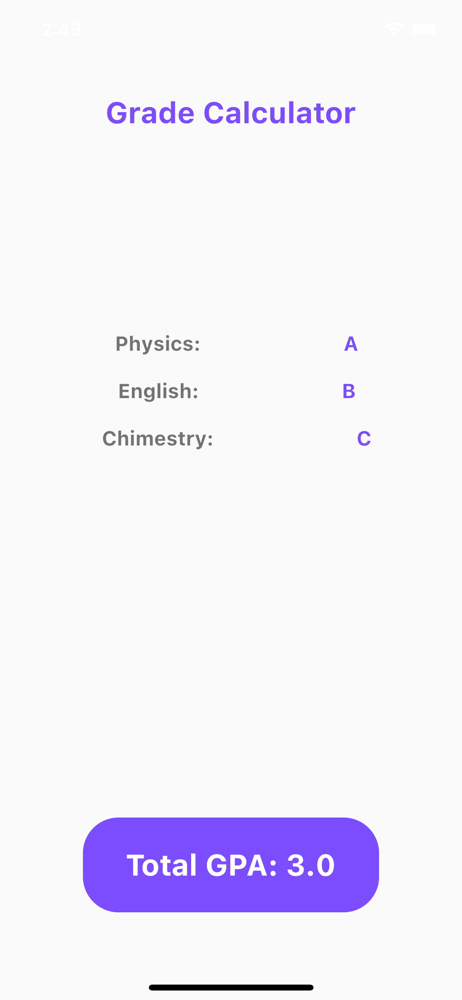

# UC-Flutter-cw-4

---

## تمرين

المطلوب صنع صفحة فيها صورة حيوانك المفضل و تحت الصورة نضيف بعض التفاصيل منها اسم الحيوان و العمر و الخ .. , مثال على التمرين :

### بونص

ضع نص بجانب الصورة

---

## تمرين بونص

قم بإنشاء تطبيق مشابه للصوره أسفل

